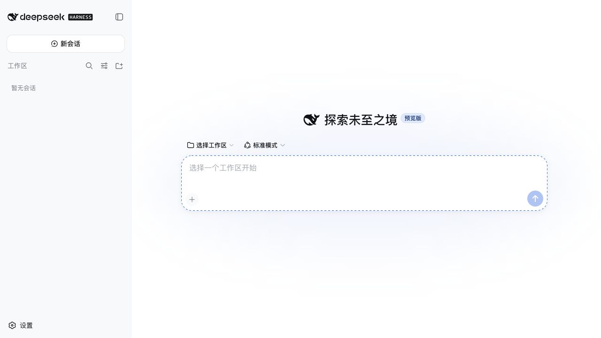

# DeepSeek Harness Desktop

[English](README.en.md) | 中文

[](https://github.com/lonesafe/deepseek-harness-desktop/actions/workflows/desktop.yml) [](https://github.com/lonesafe/deepseek-harness-desktop/releases) [](LICENSE) 

**运行环境零配置 · 简单易用 · 开箱即用 · 零开发门槛**

下载安装后直接打开，无需安装 Node.js、pnpm、Electron，无需执行终端命令，也无需手动启动浏览器。桌面客户端已经包含运行 DeepSeek Harness 所需的完整环境；需要调用模型时，可直接在应用内填写服务商要求的凭据。

[下载 DeepSeek Harness Desktop 1.0 Beta 1](https://github.com/lonesafe/deepseek-harness-desktop/releases/tag/v1.0.0-beta.1)

DeepSeek Harness Desktop 将官方开源的 [DeepSeek Harness](https://github.com/deepseek-ai/deepseek-harness) Web 体验打包成适用于 macOS、Linux 和 Windows 的自包含桌面应用。安装包内含 Electron、Node.js、生产插件图和 Web 资源，用户无需安装 Node.js、pnpm，也无需手动打开浏览器。

这是由社区维护的桌面发行版，并非 DeepSeek 官方产品，也未获得 DeepSeek AI 的认可或隶属关系。

## 界面预览



## 下载并开始使用

1. 打开 [v1.0.0-beta.1 Release](https://github.com/lonesafe/deepseek-harness-desktop/releases/tag/v1.0.0-beta.1)。
2. 下载适合当前系统的安装包。
3. 安装并打开应用。

| 平台 | 架构 | 安装包 |
|---|---:|---|
| macOS | Apple Silicon | DMG 或 ZIP |
| macOS | Intel | DMG 或 ZIP |
| Windows | x64 | NSIS 安装程序或 ZIP |
| Linux | x64 | AppImage 或 DEB |

Beta 安装包尚未签名。macOS 可能需要按住 Control 点击应用并选择**打开**；Windows SmartScreen 可能显示未知发布者警告。安装前请核对 Release 中的校验值。

## 远程访问

需要从外网手机或其他浏览器使用自己的电脑的dsh时：

1. 在桌面客户端的 **DeepSeek Harness**／**应用**菜单中选择**远程访问…**，再选择**登录并授权**。登录和注册在系统浏览器打开的官网中完成，桌面客户端不会读取官网密码。
2. 网页确认设备授权后返回桌面客户端，选择**开启远程控制**。该功能默认关闭；开启后电脑主动建立加密出站连接，无需公网 IP、端口映射或路由器设置。
3. 登录官网的**设备中心**，选择属于当前账号的在线电脑并点击**连接**。

远程连接使用一次性短期票据和独立设备凭据。网页壳、插件脚本、样式和字体由官网直接提供并长期缓存，只有 `/api` 请求和业务 WebSocket 经过设备隧道；关闭桌面端远程控制会立即停止出站连接，也可以在设备中心撤销设备。远程浏览器可以运行会话和 Agent，但宿主设置、凭据管理、原生文件选择及打开路径等本机专属操作仍只允许桌面窗口调用。官网和中转服务是独立部署的 Go、MySQL 与 Vue 3 项目，不包含在本仓库中。

## 为什么能够零配置使用

- **无需安装运行环境：**安装包已经包含 Electron、Node.js、生产插件图和 Web 资源。
- **无需使用命令行：**桌面启动器会自动启动和关闭本地 Harness 服务。
- **无需单独打开浏览器：**完整的 Harness 界面会直接显示在桌面窗口中。
- **无需开发环境：**下载适用于 macOS、Windows 或 Linux 的原生安装包即可开始使用。

## Beta 状态

`v1.0.0-beta.1` 是首个公开桌面 Beta。启动器和打包运行时已在 Apple Silicon macOS 上完成冒烟测试；原生构建矩阵会分别生成 macOS Intel、Linux x64 和 Windows x64 产物。DeepSeek Harness 本身仍在快速开发，稳定桌面版发布前，配置、插件和持久化数据都可能发生变化。

<a id="run"></a><a id="run-from-source"></a>

## 从源码构建

需要 Git、Node.js 24 和 pnpm 11。

```sh
git clone https://github.com/lonesafe/deepseek-harness-desktop.git
cd deepseek-harness-desktop
pnpm install
pnpm run desktop:dist
```

当前平台的安装包会写入 `dist/desktop`。原生依赖会在安装阶段按平台选择，因此每个目标都应在对应操作系统上打包：

```sh
pnpm run desktop:dist:mac
pnpm run desktop:dist:linux
pnpm run desktop:dist:windows
```

[桌面安装包工作流](.github/workflows/desktop.yml)使用 GitHub 原生 runner 构建 macOS arm64、macOS x64、Linux x64 和 Windows x64。推送 `v*` 标签后，工作流会把安装包附加到对应 GitHub Release。

## 开发与验证

```sh
pnpm run desktop:dev
pnpm --dir apps/desktop run test
pnpm run verify-desktop-runtime-closure
pnpm run build
```

运行时闭包门禁会验证：动态加载的生产插件图所需的每个 workspace peer 都已进入打包后的应用。

## 应用数据

Harness 数据位于 Electron 标准逐用户应用数据目录的 `runtime` 子目录。卸载应用不会自动删除这些数据。如果已保存的会话很重要，请在不同 Beta 版本之间迁移前进行备份。

## 上游与许可证

智能体运行时、Web UI 和插件系统来自 [deepseek-ai/deepseek-harness](https://github.com/deepseek-ai/deepseek-harness)。桌面专用代码位于 [`apps/desktop`](apps/desktop)，架构决策记录在 [Electron 桌面启动器说明](.agents/notes/implemented/architecture/2026-08-15-electron-desktop-launcher.md)和[账号设备中转说明](.agents/notes/implemented/feature/2026-08-15-account-device-remote-relay.md)中。

项目采用 [MIT 许可证](LICENSE)分发。第三方声明见 [THIRD_PARTY_NOTICES.md](THIRD_PARTY_NOTICES.md)。
